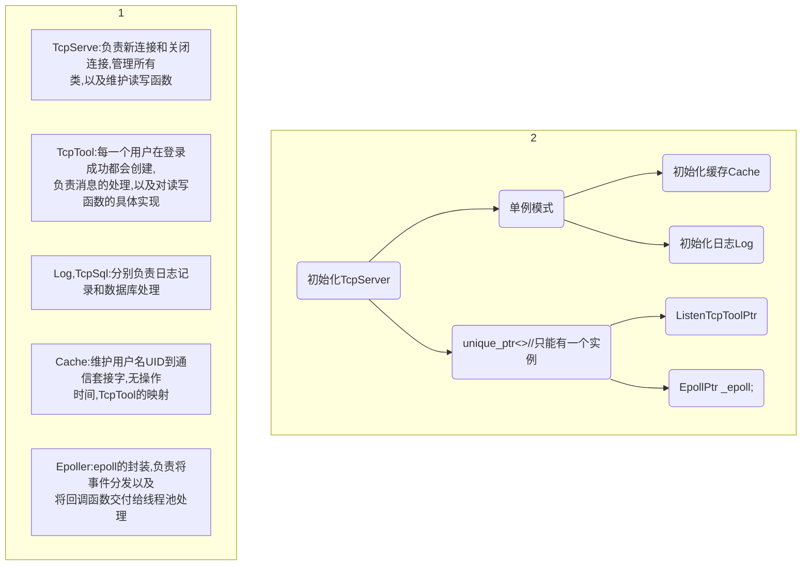
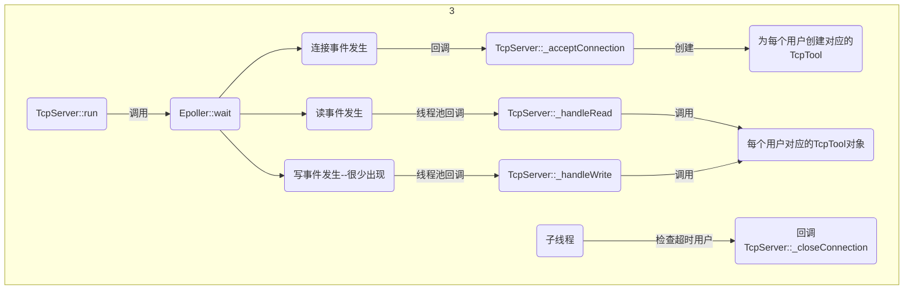

#single reactor + threadPool


# 流程图






```c++
using NewConnectionCallback = std::function<void()>;  //相当于定义了一种函数类型
using HandleReadCallback = std::function<void(TcpTool*)>; // 处理读的回调用函数
using HandleWriteCallback = std::function<void(TcpTool*)>; // 处理写的回调函数
using CloseConnectionCallback = std::function<void(TcpTool*)>; // 关闭连接的回调函数

// this在这里使得回调函数是由当前TcpServer类来调用的
// std::bind 绑定成员函数要指定类的对象，因为成员函数是依赖于对象的
_epoll->setNewConnection(std::bind(&TcpServer::_acceptConnection,this));
// std::bind(&TcpServer::_acceptConnection,this)  返回一个可调用对象
_epoll->setWriteCb(std::bind(&TcpServer::_handleWrite,this,std::placeholders::_1));
// std::forward<decltype(PH1)>(PH1) 保持参数的类型 不会丢失右值的特性, 保持参数的完美转发
_epoll->setReadCb([this](auto && PH1) { _handleRead(std::forward<decltype(PH1)>(PH1)); });

```


